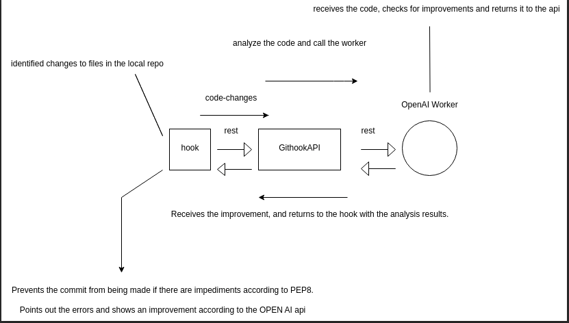

## GitHook Arqmmeds

### Considerações sobre o teste:
**Primeiramente gostaria de agradecer MUITO pela oportunidade!
Essa semana estive MUITO ocupado resolvendo algumas coisas pessoais, então fiz o que pude no menor tempo.**

#### O que teria feitoo diferente?

- Documentado melhor.
- Tipado melhor.
- Usado mais abstração e dataclasses.
- feito TODOS os testes possíveis.
- deixado o código mais "clean".
- Feito a instalação do hook como pacote e não da forma que fiz.
- Feito um melhor diagrama.
- Fazer melhor a diivisão das responsabilidades.
- Feito mais de um githook.

#### Tive uma má sorte de ter acontecido um imprevisto grande.
#### Muito obrigado pelo teste e quaisquer duvidas sobre como rodar, pode me chamar:
#### 31 99743-9524 Kaique
#### Se eu tiver a sorte de fazer parte da arkmeds, serei a melhor contratação já vista.
#### Essa empresa irá crescer dia apos dia e essa será minha missão profissional.

### Comece por aqui: Didimo, Júlio, ETC:
### [>>> CLIQUE AQUI <<<](https://github.com/kaiqueBellmont/githookAPI)